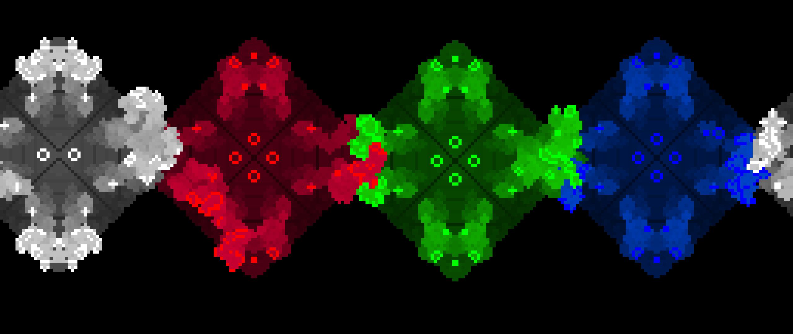

# Game Of Life

By [Lidor Shimoni](https://github.com/lidorshimoni)

Implemented Game of Life using Processing 
just messing around with the features and trying to make it playable

## Features
* free-hand draw
* pause
* fastforward
* nice graphics
* multi player game

## Example

## Dependencies
The following dependencies are required:
* processing

